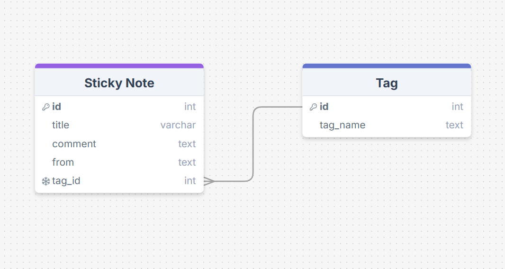
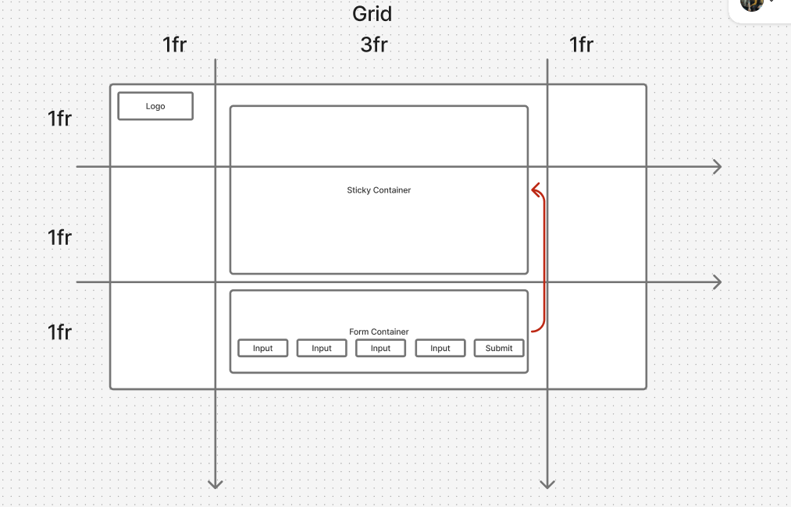

## Week 7

For this assignment, I created an app called sticky.note!

The initial idea of this was quite simple, as I used a one to many database to submit and recieve post-it notes containing unique information (title, post, user) and a tag that shares an ID with any tags of the same name.

I liked this idea as although it was simple, a tag database connected by a foreign key would allow me to alter this app for a variety of uses such as a job tracker, to do list, ect as you'd be able to submit and filter data through tags.

I didn't manage to have a feature that lets you filter through the tags in the end, but as each tag id matches the note_id of any post that shares that tag, the hard part is done, and it'll be simple to add this in the future!

## Reflection

## What requirements did you achieve?

- Create a client using React ✅
- Use Express to create your server, using both GET and POST endpoints ✅
- Build a React form for users to create posts ✅
- Create multiple pages using React Router ❌
- Design a database schema, and seed the database with some realistic data ✅
- Use SQL to retrieve posts from the database in your Express server ✅
- Display all posts using .map() ✅
- Use an interval and useEffect() to poll your database ❌

## Were there any requirements or goals that you were unable to achieve?

- Create multiple pages using React Router ❌

  - I had a good understanding of this during our regular workshops, and think I could see myself adding this feature into this app quite well.
  - For example, multiple pages could be used to view different data results based on each tag (although this can also just be done by rerendering the information into the stickyNoteContainer)
  - ## If so, what was it that you found difficult about these tasks?
  - I couldn't finish this due to time constraints, It took a lot of time to create and gain understanding on the databases, followed by building the rest of the website and its CSS.
  - On Reflection, I wish I just created a simple "about" route linked to the homepage to show you have I can do it!

- Use an interval and useEffect() to poll your database ❌
  - I had two different ideas on how to update the website database, by either using a setInterval of 1 second that pulls information from the database to my stickyNoteContainer, or by using useEffect to rerender information from the database to the container upon every submit.
  - Using a setInterval would have been the simplest and would allow you to see your form submission to the website, as well as any other users that may be submitting from the form on another device. So I think this is how i'd do this, however I feel that in an actual web application it would not be reccomended to poll the database every second.
  - ## If so, what was it that you found difficult about these tasks?
  - Time constraints!

## Other reflections

- Overall, I had a great time working on this assignment, however, it was not for it's issues.
- Being our first full-stack assignment it felt like a much larger project, although this was exciting to make both the front and back-end of a website, it took me a lot longer than expected to complete these assignment.
  - Majority of my time was spend on the back-end, creating and setting up my databases
  - Creating a one to many relationship between my two databases was the most difficult, I really struggled to grasp how to pair a foreign key to the value of another database.
  - I did manage this in the end, and although I did not have time to add any features that let you filter by tag, tags with the same name will share an id which would make this very doable in the future.
  - Overall, this highlighted that I struggle with the back-end the most when creating a full-stack-app.
- I found the CSS to be a really fun time, as this was a full stack app it felt like our assignment was a real functional website and therefore wanted to make the app look polished and resemble a real website instead of an assignment.
- I struggle a lot when creating media queries for desktop and mobile versions, especially using grid.
  - I find grid to be really useful when creating my website, however I usually encounter a lot of problems when designing my website for a mobile resolution, I think this is mainly to do with objects being larger than the grid area it's in and other similar methods.

## Database Schema and Wireframe

## Resources

- One to many relationships: https://devdotcode.com/how-to-implement-one-to-many-association-in-mysql-node-js-api/

- A cool graph paper background in css: https://stackoverflow.com/questions/3540194/how-to-make-a-grid-like-graph-paper-grid-with-just-css
- Other css references: https://www.w3schools.com/css/css3_shadows_box.asp
